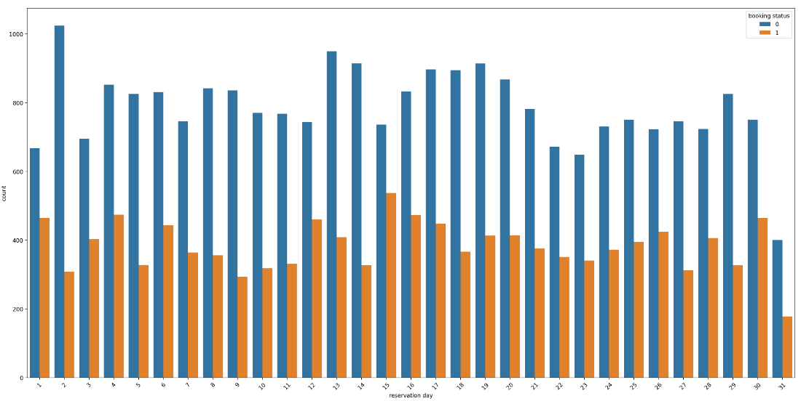
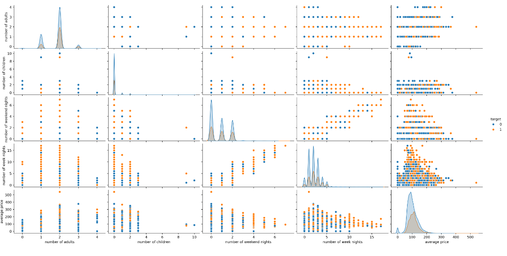
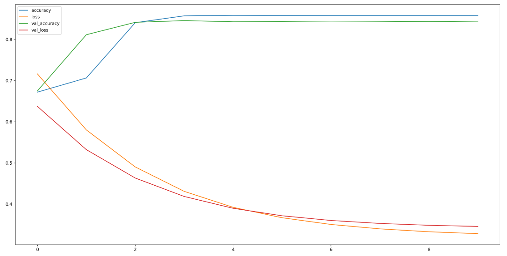

# Hotel-Booking-NN-Ensemble

The analysis presented in this report seeks to create whether a hotel customer will cancel or not cancel his/her rreservation based on 17 features. It also aims to create 2 NN models, then using ensemble to combine said models and (possibly) increase prediction accuracy

## Description

The analysis will look at the open source data from kaggle on hotel booking cancellations (https://www.kaggle.com/datasets/youssefaboelwafa/hotel-booking-cancellation-prediction). The dataset is checked for missing values, then formatted appropriately to optimize statistical analysis. Both categorical and numerical features are plotted to consider correlation with cancellation and non-cancellations. Subsequently 2 neural networks will be created as well as 2 ensemble modles: one using linear regression, and one using a third (simplidied) neural network. Ultimately the predictive power of each model is calculated and tested using a batch of fictitious data

## Getting Started

### Dependencies

Before installing and running this project, please ensure you meet the following requirements:

Operating System:

Windows: Windows 10 or later is recommended for optimal compatibility.
macOS: A recent version (macOS Catalina or later) is advisable.
Linux: Any modern distribution (like Ubuntu 20.04 LTS or later) should work well.
Programming Environment:

This project was created using Jupyter Notebook and the latest Python/Tensorflow release.

## Sample Output

## Authors

Yuri Lazzeretti

ylazz001@gmail.com

www.linkedin.com/in/yuri-lazzeretti-b63a22220
